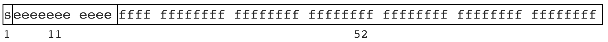

> hi

>忙不

> UIPercent 输入99.99后，table进行forceupdate后，会变成99.98

- - - 
### 诺  bug又来了。
经过排查 发现是这里除了问题。
传入`99.99`,value的值逐步变化：

    console.log("原来value",value);// 99.99
    console.log("除以100之后",value/100);// 0.9998999999999999
    let result = parseFloat(value / 100);
    console.log("parseFloat之后",result);// 0.9998999999999999
    
- - - 
### JS精度丢失的原因
计算机的二进制实现和位数限制有些数无法有限表示。就像一些无理数不能有限表示，如 圆周率 3.1415926...，1.3333... 等。
JS 遵循 [IEEE 754](https://en.wikipedia.org/wiki/IEEE_754) 规范，采用双精度存储（double precision），占用 64 bit。如图:

意义：

- 1位用来表示符号位;
- 11位用来表示指数;
- 52位表示尾数;

浮点数，比如

    0.1 >> 0.0001 1001 1001 1001…（1001无限循环）
    0.2 >> 0.0011 0011 0011 0011…（0011无限循环）
    
此时只能模仿十进制进行四舍五入了，但是二进制只有 0 和 1 两个，于是变为 0 舍 1 入。这即是计算机中
部分浮点数运算时出现误差，丢失精度的根本原因。

大整数的精度丢失和浮点数本质上是一样的，尾数位最大是 52 位，因此 JS 中能精准表示的最大整数是 Math.pow(2, 53)，
十进制即 9007199254740992。

大于 9007199254740992 的可能会丢失精度

    9007199254740992     >> 10000000000000...000 // 共计 53 个 0
    9007199254740992 + 1 >> 10000000000000...001 // 中间 52 个 0
    9007199254740992 + 2 >> 10000000000000...010 // 中间 51 个 0

实际上

    9007199254740992 + 1 // 丢失   9007199254740992
    9007199254740992 + 2 // 未丢失 9007199254740994
    9007199254740992 + 3 // 丢失   9007199254740996
    9007199254740992 + 4 // 未丢失 9007199254740996

#### 所以可知看似有穷的数字, 在计算机的二进制表示里却是无穷的，由于存储位数限制因此存在“舍去”，精度丢失就发生了。
- - -
### 解决方法：
> 通过字符串进行转换。

    /**
     * 通过字符串操作将一个数放大或缩小指定倍数
     * @num 被转换的数
     * @m   放大或缩小的倍数，为正表示小数点向右移动，表示放大；为负反之
     */
    function numScale(num, m) {
      // 拆分整数、小数部分
      let parts = num.toString().split('.');
      // 原始值的整数位数
      const integerLen = parts[0].length;
      // 原始值的小数位数
      const decimalLen = parts[1] ? parts[1].length : 0;

      // 放大，当放大的倍数比原来的小数位大时，需要在数字后面补零
      if (m > 0) {
        // 补多少个零：m - 原始值的小数位数
        let zeros = m - decimalLen;
        while (zeros > 0) {
          zeros -= 1;
          parts.push(0);
        }
      // 缩小，当缩小的倍数比原来的整数位大时，需要在数字前面补零
      } else {
        // 补多少个零：m - 原始值的整数位数
        let zeros = Math.abs(m) - integerLen;
        while (zeros > 0) {
          zeros -= 1;
          parts.unshift(0);
        }
      }

      // 小数点位置，也是整数的位数: 
      //    放大：原始值的整数位数 + 放大的倍数
      //    缩小：原始值的整数位数 - 缩小的倍数
      let index = integerLen + m;
      // 将每一位都拆到数组里，方便插入小数点
      parts = parts.join('').split('');
      // 当为缩小时，因为可能会补零，所以使用原始值的整数位数
      // 计算出的小数点位置可能为负，这个负数应该正好是补零的
      // 个数，所以小数点位置应该为 0
      parts.splice(index > 0 ? index : 0, 0, '.');

      return parseFloat(parts.join(''));
    }
    
#### 例子
    console.log(numScale(99.99,-2)); //0.9999
    console.log(numScale(9.99,-2));  //0.0999
    console.log(numScale(0.99,-2));  //0.0099
    console.log(numScale(0.99,2));   //99
    console.log(numScale(9.99,2));   //999
    console.log(numScale(99.99,2));  //9999
    
- - - 
## OVER 
